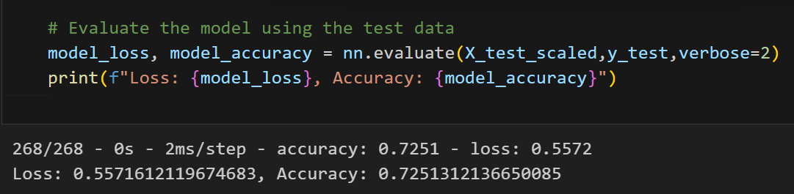
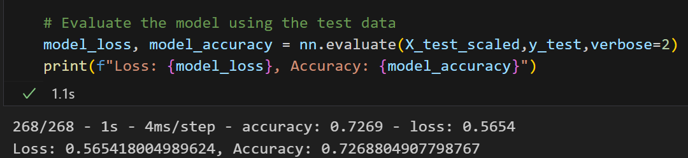
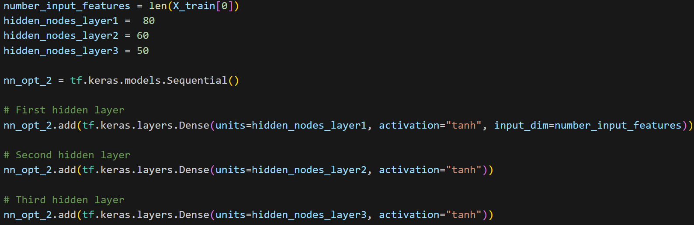
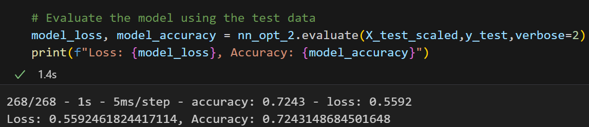
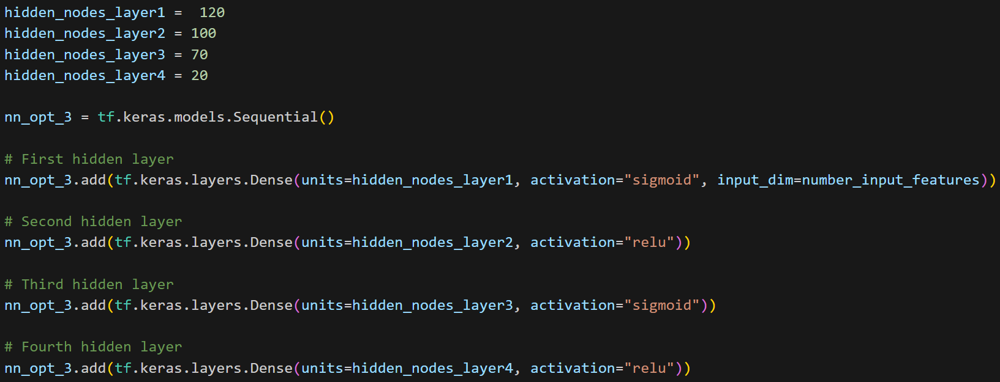
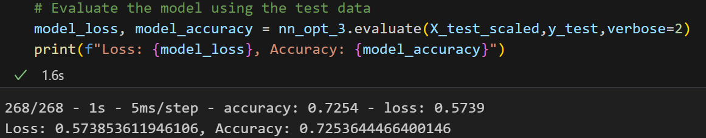

# Report on the Performance of Deep Learning Model for Alphabet Soup

## Overview:
The purpose of this analysis is to develop a binary classification model using deep learning techniques to predict whether an organisation funded by Alphabet Soup will be successful based on various features provided in the dataset. The dataset contains information about over 34,000 organizations, including metadata such as application type, affiliation, classification, use case, funding amount requested, and more.

## Results:
**Data Preprocessing**

Target Variables: The target variable for our model is `IS_SUCCESSFUL`

Feature Variables: All columns except `EIN` and `NAME` are considered as features for model development.

Variables Removed: `EIN` and `NAME` columns were dropped as they are identification variables.

**Compiling, Training, and Evaluating the Model**

**Number of neurons, layers, and activation functions selected for neural network model**

- Initially, I have considered 2 hidden layers with "ReLU" activation function due to its ability to introduce non-linearity while being computationally efficient and "Sigmoid" for the output layer for binary classification tasks.
- Then, the model is compiled using binary cross-entropy as the loss function, which is suitable for binary classification tasks
- The model is trained using the scaled training data (X_train_scaled, y_train) for 100 epochs.
- After training, the model's performance is evaluated using the scaled testing data (X_test_scaled, y_test).

Below are the results for test data evaluation:

**Target model performance**

It is expected to have at least 75% accuracy but the results of the test data is 72% as shown in the above image.

**Steps taken to increase model performance?**
I have made 3 attempts to increase the performance of the model.

Attempt-1:

- In this attempt, I have added 3rd hidden layer with 40 neurons and have choosen the "ReLU" activation function for all the 3 layers.
- Then, the model is compiled using binary cross-entropy as the loss function and the model is trained using the scaled training data (X_train_scaled, y_train) for 100 epochs.
- Below are the results for test data and it is still 72%

Attempt-2:

- In this attempt, I have changed the number of neurons for each layer as mentioned below and have choosen "tanh" activation function.

- Then, again the model is compiled using binary cross-entropy as the loss function and the model is trained using the scaled training data (X_train_scaled, y_train) for 200 epochs.
- Below are the results for test data and it is still 72%

Attempt-3:

- In this attempt, I have changed the number of neurons for each layer as mentioned below and have choosen activation function.

- Then, again the model is compiled using binary cross-entropy as the loss function and the model is trained using the scaled training data (X_train_scaled, y_train) for 200 epochs.

- Below are the results for test data and it is still 72%

## Summary:

The deep learning model developed for predicting the success of organisations funded by Alphabet Soup achieved an accuracy of 72% across all optimisation attempts. While the model's performance is acceptable, it falls short of the target accuracy of 75%.

Despite employing various optimisation techniques such as adjusting input data, experimenting with different neural network architectures, and tuning hyperparameters, the model struggled to achieve higher accuracy. This suggests that the complexity of the classification problem may require a more sophisticated approach beyond traditional neural networks.

